# rest API with JWT auth

Сначала попытаемся получить доступ без токена:
​
Не получилось, регистрируем нового юзера:  
​
Получаем токен по введенным данным:
​
Используя токен, получаем список задач (пока пустой):
​
Добавим пару задач в список:
​
​
Выведем обновленный список:
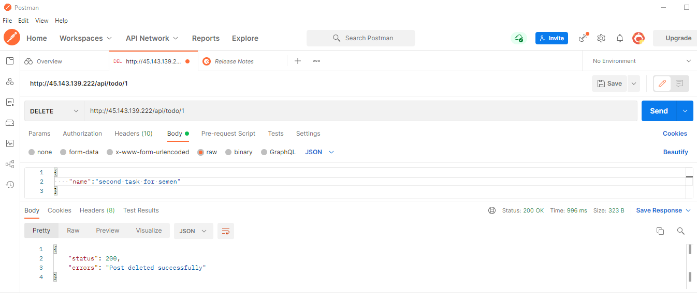​
Удалим первую задачу, и отредачим вторую:
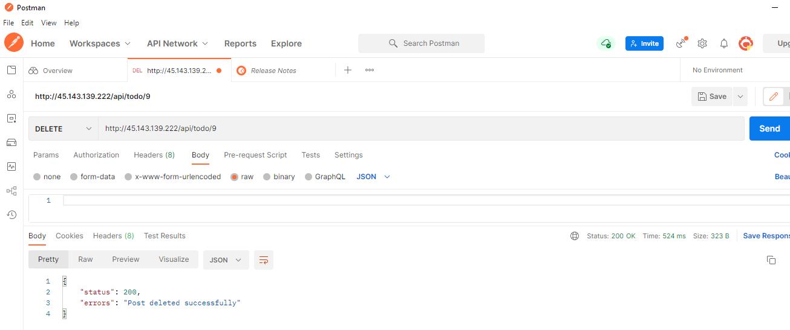​
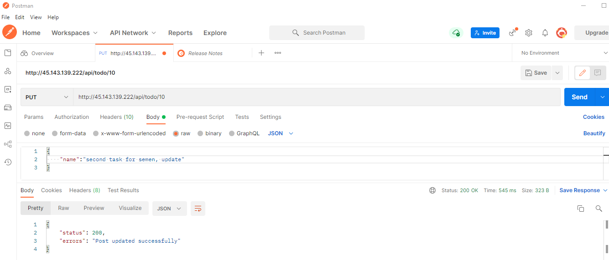​
Посмотрим на изменения:
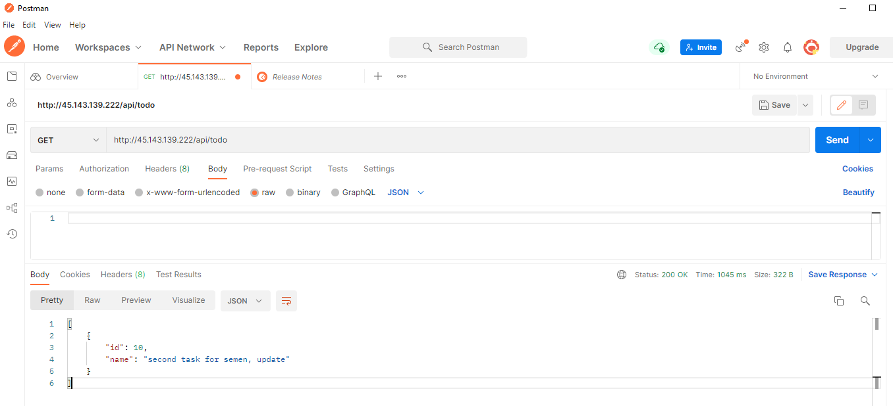​
Теперь создадим нового юзера и получим для него токен:
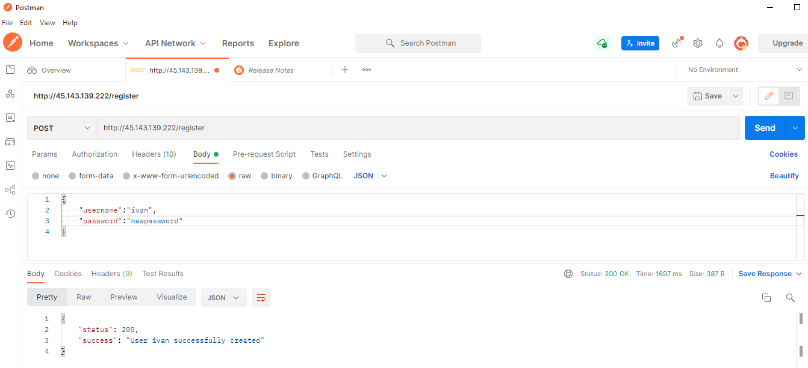​
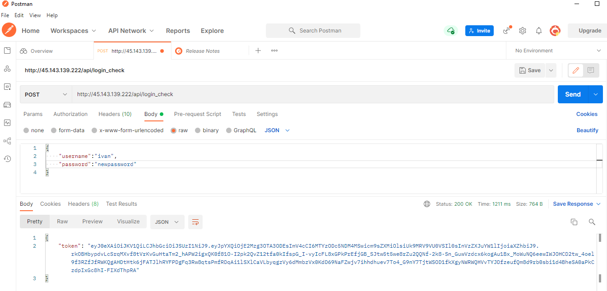​
Выведем список задач, он пуст, т.к. задачи привязаны к другому юзеру
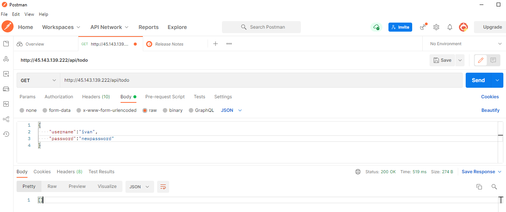​
Получить, удалить и отредачить по id также не удаётся
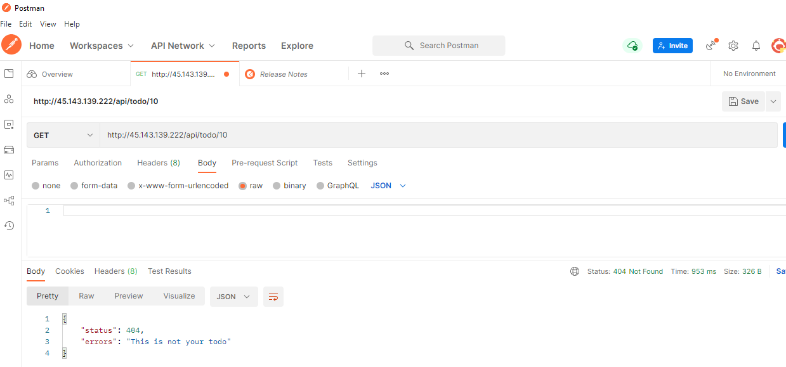​
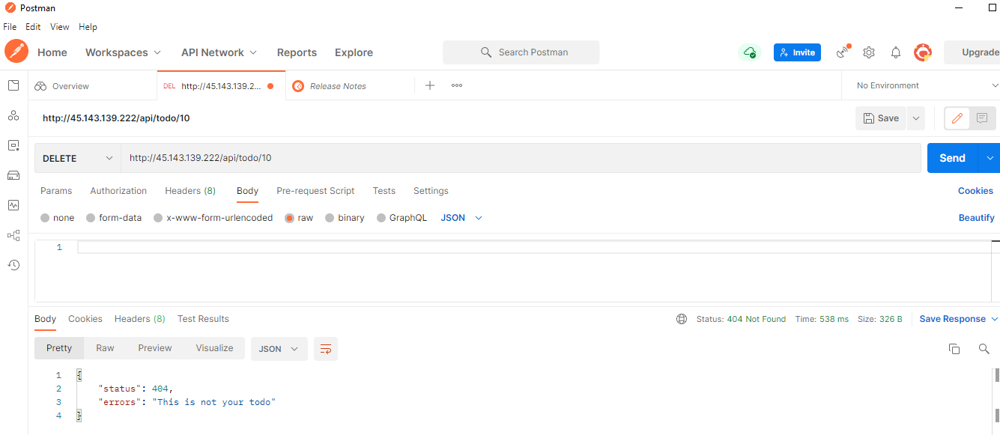​
​
Добавим задачу для нового юзера, она корректно отображается
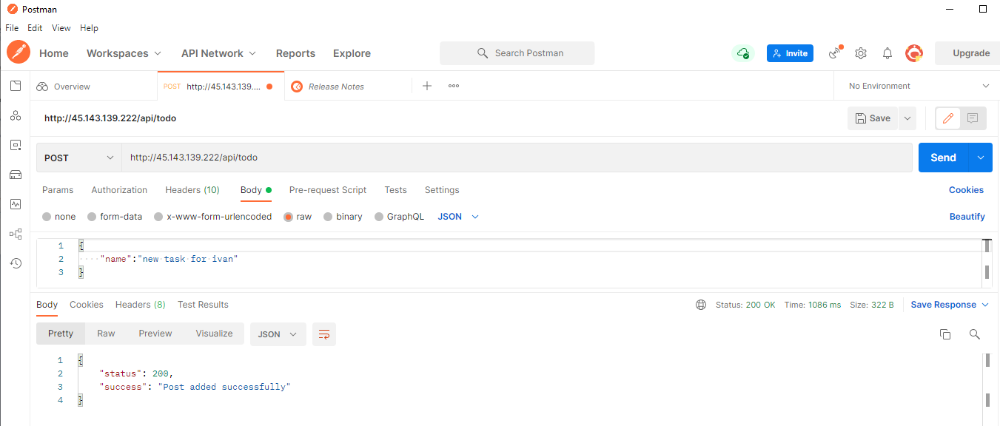​
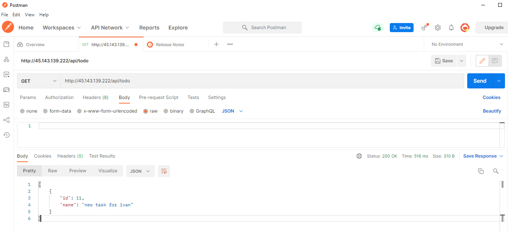​
