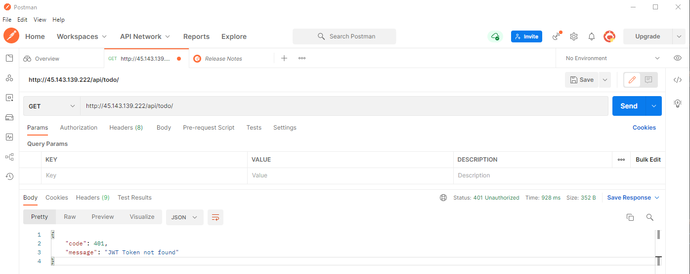
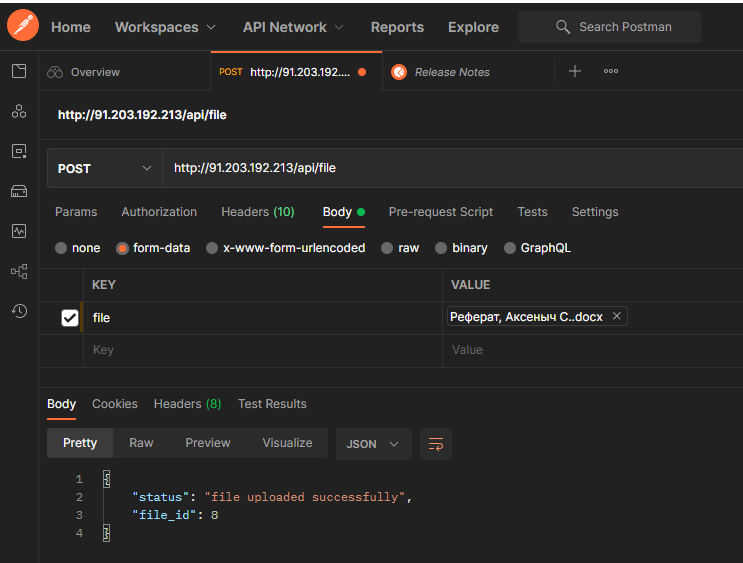
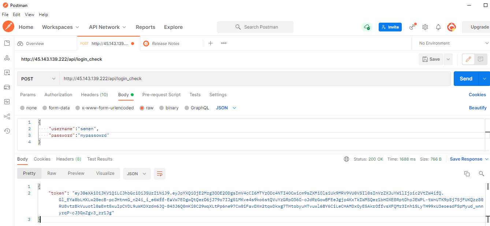
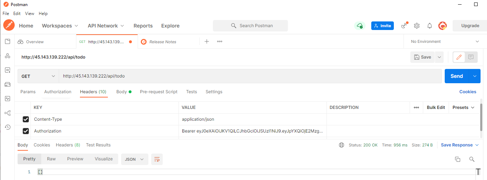
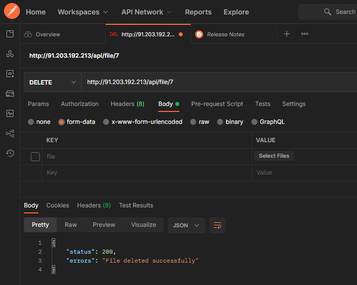
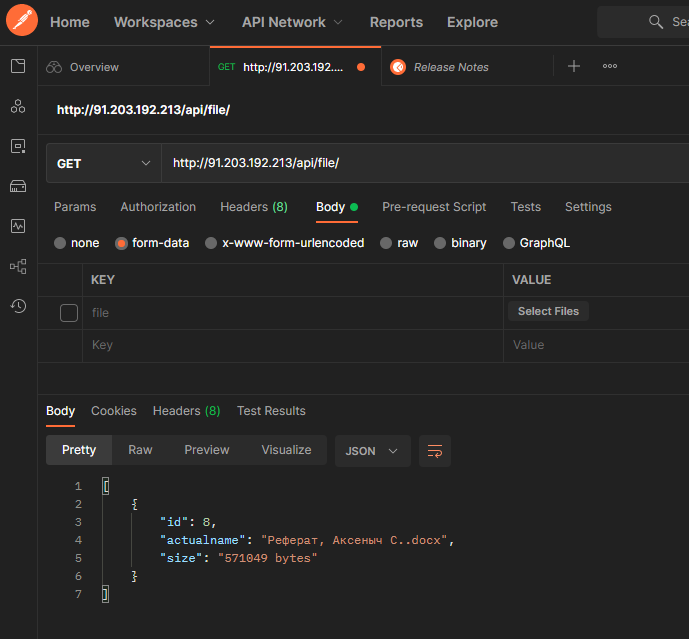

# rest API File Storage with JWT auth

Используется JWT auth, как в первом задании: https://github.com/umaidila/practice_symfony1

Загрузка файла:

И еще один:

Вывод списка всех файлов:

Загрузка файла:

Удаление файла и вывод обновленного списка:

