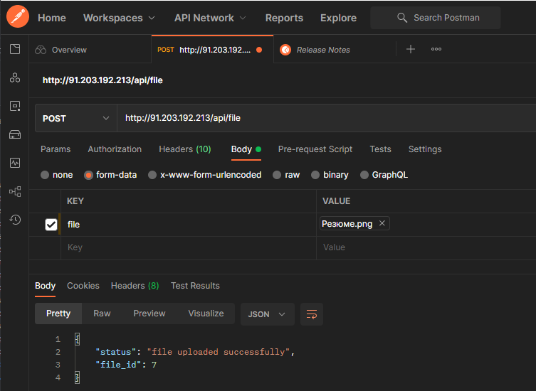

# rest API with JWT auth

Сначала попытаемся получить доступ без токена:
​
Не получилось, регистрируем нового юзера:  
​
Получаем токен по введенным данным:
​
Используя токен, получаем список задач (пока пустой):
​
Добавим пару задач в список:
​
​
Выведем обновленный список:
